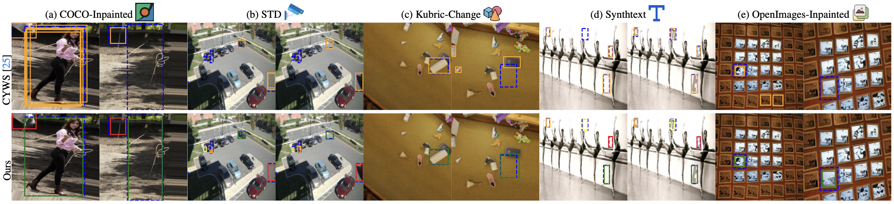

# Improving zero-shot object-level change detection by incorporating visual correspondence

<div align="center">    
    <p style="font-size: 45px;"> by 
        Hung Huy Nguyen</a><sup>1</sup>,
        <a href="https://pooyanrg.me">Pooyan Rahmanzadehgervi</a><sup>1</sup>, 
        <a href="https://mai-t-long.com">Long Mai</a><sup>2</sup>, 
        <a href="https://anhnguyen.me/research/">Anh Totti Nguyen</a><sup>1</sup>
    </p>
    <p>
        <sup>1</sup>Auburn University, <sup>2</sup>Adobe Research
    </p>

[](https://arxiv.org/abs/2501.05555)
[](https://huggingface.co/papers/2501.05555)
[](LICENSE)
    
</div>

This repository contains the code and data for the paper `Improving zero-shot object-level change detection by incorporating visual correspondence` (WACV 2025).

## 📌 Abstract
<p align="center">
  <!-- Insert key figure from your paper here -->
  
</p>

*Detecting object-level changes between two images across possibly different views (Fig. 1) is a core task in many applications that involve visual inspection or camera surveillance. Existing change-detection approaches suffer from three major limitations: (1) lack of evaluation on im- age pairs that contain no changes, leading to unreported false positive rates; (2) lack of correspondences (i.e., local- izing the regions before and after a change); and (3) poor zero-shot generalization across different domains. To ad- dress these issues, we introduce a novel method that lever- ages change correspondences (a) during training to im- prove change detection accuracy, and (b) at test time, to minimize false positives. That is, we harness the supervision labels of where an object is added or removed to supervise change detectors, improving their accuracy over previous work [25] by a large margin. Our work is also the first to predict correspondences between pairs of detected changes using estimated homography and the Hungarian algorithm. Our model demonstrates superior performance over exist- ing methods, achieving state-of-the-art results in change de- tection and change correspondence accuracy across both in-distribution and zero-shot benchmarks.*

<!--
A comparison between The Change You Want to See (CYWS) and our model's quality outcomes
 -->

## 🚀 1. Installation
```
conda create -n cyws python=3.9
conda activate cyws
conda install -c pytorch pytorch=1.10.1 torchvision=0.11.2 cudatoolkit=11.3.1
pip install kornia@git+https://github.com/kornia/kornia@77589a58be6c603b7afd755d261783bd0c152a97
pip install matplotlib Shapely==1.8.0 easydict pytorch-lightning==1.5.8 loguru scipy h5py
python -m pip install detectron2 -f https://dl.fbaipublicfiles.com/detectron2/wheels/cu113/torch1.10/index.html
pip install mmcv-full==1.7.0 -f https://download.openmmlab.com/mmcv/dist/cu113/torch1.10/index.html
pip install mmdet==2.28.2 wandb
pip install segmentation-models-pytorch@git+https://github.com/ragavsachdeva/segmentation_models.pytorch.git@0092ee4d6f851d89a4a401bb2dfa6187660b8dd3
pip install imageio==2.13.5
SuperGlue https://github.com/magicleap/SuperGluePretrainedNetwork/tree/ddcf11f42e7e0732a0c4607648f9448ea8d73590
```

## 📥 2. Datasets

### 2.1. COCO-Inpainted

[Download as .tar](https://thor.robots.ox.ac.uk/~vgg/data/cyws/coco-inpainted.tar)
```
coco_inpainted
└───train
│   │   data_split.pkl
│   │   list_of_indices.npy
│   │
│   └───images_and_masks
│   |   │   <index>.png (original coco image)
│   |   │   <index>_mask<id>.png (mask of inpainted objects)
│   |   │   ...
|   |
│   └───inpainted
│   |   │   <index>_mask<id>.png (inpainted image corresponding to the mask with the same name)
│   |   │   ...
|   |
│   └───metadata
│   |   │   <index>.npy (annotations)
│   |   │   ...
│   
└───test
│   └───small
│   │   |   data_split.pkl
│   │   |   list_of_indices.npy
│   │   └───images_and_masks/
│   │   └───inpainted/
│   │   └───metadata/
│   │   └───test_augmentation/
|   |
│   └───medium/
│   └───large/
```

### 2.2. Kubric-Change

[Download as .tar](https://thor.robots.ox.ac.uk/~vgg/data/cyws/kubric-change.tar)
```
kubric_change
│   metadata.npy (this is generated automatically the first time you load the dataset)
│   <index>_0.png (image 1)
|   <index>_1.png (image 2)
|   mask_<index>_00000.png (change mask for image 1)
|   mask_<index>_00001.png (change mask for image 2)
|   ...
```

### 2.3. VIRAT-STD

[Download original images using link provided by Jhamtani et al.](https://drive.google.com/file/d/1OVb4_3Uec_xbyUk90aWC6LFpKsIOtR7v/view?usp=sharing) + [Download our annotations as .npy.gz](https://thor.robots.ox.ac.uk/~vgg/data/cyws/virat-annotations.npy.gz)


```
std
│   annotations.npy (ours)
│   <index>.png (provided by Jhamtani et al.)
|   <index>_2.png (provided by Jhamtani et al.)
|   ...
```

### 2.4. Synthtext-Change

[Download original bg images as .tar.gz](https://thor.robots.ox.ac.uk/~vgg/data/scenetext/preproc/bg_img.tar.gz) + [Download synthetic text images as .h5.gz](https://thor.robots.ox.ac.uk/~vgg/data/cyws/synthtext-change.h5.gz)

```
synthtext_change
└───bg_imgs/ (original bg images)
|   | ...
│   synthtext-change.h5 (images with synthetic text we generated)

```

### 2.5. OpenImage-Inpainted

The test set is available [here](https://huggingface.co/datasets/XAI/OpenImages-Inpainted)
```
openimage-inpainted-test
│   └───images_and_masks
│   |   │   <index>.png (original coco image)
│   |   │   <index>_mask<id>.png (mask of inpainted objects)
│   |   │   ...
|   |
│   └───inpainted
│   |   │   <index>_mask<id>.png (inpainted image corresponding to the mask with the same name)
```


## 💻 3. How to run
### 3.1.Training

Download all pretrained models prior to initiating the training and evaluation process.
[Pre-trained model of CYWS](https://thor.robots.ox.ac.uk/~vgg/data/cyws/pretrained-resnet50-3x-coam-scSE-affine.ckpt.gz)
[DeepEMD pre-trained model](https://github.com/icoz69/DeepEMD)
[SuperGlue](https://github.com/magicleap/SuperGluePretrainedNetwork/tree/ddcf11f42e7e0732a0c4607648f9448ea8d73590)
[Our fine-tunned model](https://drive.google.com/file/d/1ISFReljEB46HHamDVl_N6je7CuqwTIG7/view?usp=sharing)

`main.py --method centernet --gpus 4 --config_file configs/detection_resnet50_3x_coam_layers_affine.yml --max_epochs 200 --decoder_attention scse --load_weights_from ./checkpoints/pretrained-resnet50-3x-coam-scSE-affine.ckpt`

### 3.2. Reproduce detection performance

To reproduce the mAP score in Tab. 4, please run.

`python3 evaluation.py --method centernet --gpus 1 --config_file ./configs/detection_resnet50_3x_coam_layers_affine.yml --decoder_attention scse --load_weights_from ./checkpoints/pretrained_matching_loss.ckpt`

### 3.3. Reproduce correspondence performance

To reproduce the F1 score of CYWS and our models in Tab. 6, please run.

`python3 evaluation.py --method centernet --gpus 1 --config_file ./configs/detection_resnet50_3x_coam_layers_affine.yml --decoder_attention scse --load_weights_from ./checkpoints/pretrained-resnet50-3x-coam-scSE-affine.ckpt`

`python3 evaluation.py --method centernet --gpus 1 --config_file ./configs/detection_resnet50_3x_coam_layers_affine.yml --decoder_attention scse --load_weights_from ./checkpoints/pretrained_matching_loss.ckpt`

### 3.4. Visualization

To visualize the pairs of changes between two images, similar to Fig. 1, please run. Here is an example showing the visualization results with the COCO-Inpainted dataset.

`python3 post_processing.py --load_weights_from ./checkpoints/pretrained_matching_loss.ckpt --config_file configs/detection_resnet50_3x_coam_layers_affine.yml --decoder_attention scse --data_name coco`

then we get:


## 📖 Citation

```bibtex
@inproceedings{nguyen2025improving,
  title={Improving zero-shot object-level change detection by incorporating visual correspondence},
  author={Nguyen, Hung H and Rahmanzadehgervi, Pooyan and Mai, Long and Nguyen, Anh Totti},
  booktitle={2025 IEEE/CVF Winter Conference on Applications of Computer Vision (WACV)},
  pages={8826--8833},
  year={2025},
  organization={IEEE}
}
```


